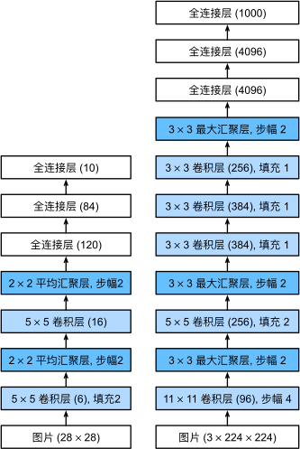

# LeNet
1. 网络定义
```
class LeNet(nn.Module):
    def __init__(self,):
        super().__init__()
        self.net = nn.Sequential(
            nn.Conv2d(1, 6, kernel_size=5, padding=2), nn.Sigmoid(),
            nn.AvgPool2d(kernel_size=2, stride=2),
            nn.Conv2d(6, 16, kernel_size=5), nn.Sigmoid(),
            nn.AvgPool2d(kernel_size=2, stride=2),
            nn.Flatten(),
            nn.Linear(16 * 5 * 5, 120), nn.Sigmoid(),
            nn.Linear(120, 84), nn.Sigmoid(),
            nn.Linear(84, 10))
    def forward(self,x):
        # y = x
        # for layer in self.net:
        #     print(layer)
        #     y = layer(y)
        #     print(y.shape)
        return self.net(x)
```
LeNet （卷积+激活+池化）*2 (线性层+激活)*3
2. shape infer
```
LeNet(
  (net): Sequential(
    (0): Conv2d(1, 6, kernel_size=(5, 5), stride=(1, 1), padding=(2, 2)) 
    (1): Sigmoid()
    (2): AvgPool2d(kernel_size=2, stride=2, padding=0)
    (3): Conv2d(6, 16, kernel_size=(5, 5), stride=(1, 1))
    (4): Sigmoid()
    (5): AvgPool2d(kernel_size=2, stride=2, padding=0)
    (6): Flatten(start_dim=1, end_dim=-1)
    (7): Linear(in_features=400, out_features=120, bias=True)
    (8): Sigmoid()
    (9): Linear(in_features=120, out_features=84, bias=True)
    (10): Sigmoid()
    (11): Linear(in_features=84, out_features=10, bias=True)
  )
)
# 输入shape (1,1,28,28) 28*28的灰度图
# Conv2d(1, 6, kernel_size=(5, 5), stride=(1, 1), padding=(2, 2))
# torch.Size([1, 6, 28, 28]) 卷积后h'=28-5+1+4=28
# Sigmoid()
# torch.Size([1, 6, 28, 28])
# AvgPool2d(kernel_size=2, stride=2, padding=0)
# torch.Size([1, 6, 14, 14]) 平均池化后特征减半14*14
# Conv2d(6, 16, kernel_size=(5, 5), stride=(1, 1))
# torch.Size([1, 16, 10, 10]) 卷积后h'=14-5+1=10,padding=0不补边
# Sigmoid()
# torch.Size([1, 16, 10, 10])
# AvgPool2d(kernel_size=2, stride=2, padding=0) 
# torch.Size([1, 16, 5, 5]) # 继续减半
# Flatten(start_dim=1, end_dim=-1)
# torch.Size([1, 400]) # 展平 len = 16*5*5
# Linear(in_features=400, out_features=120, bias=True)
# torch.Size([1, 120]) # 全连接
# Sigmoid()
# torch.Size([1, 120])
# Linear(in_features=120, out_features=84, bias=True)
# torch.Size([1, 84]) # 全连接
# Sigmoid()
# torch.Size([1, 84])
# Linear(in_features=84, out_features=10, bias=True)
# torch.Size([1, 10]) # 全连接
```
3. 可视化
lenet架构示意图

lenet的onnx结构  


# AlexNet
> AlexNet相较于Lenet模型稍微加深一点，由2个卷积单元扩展到5个卷积单元，最后的全连接层"变胖"，使用了更多的特征做全连接，AlexNet还使用了数据增强技术
AlexNet标志着新一轮的神经网络的热潮的开始，提取特征从传统的手工提取变为现在的机器提取。
 1. 网络定义
 AlexNet(
  (net): Sequential(
    (0): Conv2d(1, 96, kernel_size=(11, 11), stride=(4, 4), padding=(1, 1))
    (1): ReLU()
    (2): MaxPool2d(kernel_size=3, stride=2, padding=0, dilation=1, ceil_mode=False)
    (3): Conv2d(96, 256, kernel_size=(5, 5), stride=(1, 1), padding=(2, 2))
    (4): ReLU()
    (5): MaxPool2d(kernel_size=3, stride=2, padding=0, dilation=1, ceil_mode=False)
    (6): Conv2d(256, 384, kernel_size=(3, 3), stride=(1, 1), padding=(1, 1))
    (7): ReLU()
    (8): Conv2d(384, 384, kernel_size=(3, 3), stride=(1, 1), padding=(1, 1))
    (9): ReLU()
    (10): Conv2d(384, 256, kernel_size=(3, 3), stride=(1, 1), padding=(1, 1))
    (11): ReLU()
    (12): MaxPool2d(kernel_size=3, stride=2, padding=0, dilation=1, ceil_mode=False)
    (13): Flatten(start_dim=1, end_dim=-1)
    (14): Linear(in_features=6400, out_features=4096, bias=True)
    (15): ReLU()
    (16): Dropout(p=0.5, inplace=False)
    (17): Linear(in_features=4096, out_features=4096, bias=True)
    (18): ReLU()
    (19): Dropout(p=0.5, inplace=False)
    (20): Linear(in_features=4096, out_features=10, bias=True)
  )
)
2. shape infer
输入示例采用224  
Conv2d(1, 96, kernel_size=(11, 11), stride=(4, 4), padding=(1, 1))
torch.Size([1, 96, 54, 54]) # h'=(224-11+1+2)/4=54
ReLU()
torch.Size([1, 96, 54, 54])
MaxPool2d(kernel_size=3, stride=2, padding=0, dilation=1, ceil_mode=False)
torch.Size([1, 96, 26, 26]) # 最后一个不足 54/2-1=26
Conv2d(96, 256, kernel_size=(5, 5), stride=(1, 1), padding=(2, 2))
torch.Size([1, 256, 26, 26])
ReLU()
torch.Size([1, 256, 26, 26])
MaxPool2d(kernel_size=3, stride=2, padding=0, dilation=1, ceil_mode=False)
torch.Size([1, 256, 12, 12]) # 12
Conv2d(256, 384, kernel_size=(3, 3), stride=(1, 1), padding=(1, 1))
torch.Size([1, 384, 12, 12])
ReLU()
torch.Size([1, 384, 12, 12])
Conv2d(384, 384, kernel_size=(3, 3), stride=(1, 1), padding=(1, 1))
torch.Size([1, 384, 12, 12]) # h'=12-3+1+2 k=3,p=1,s=1时候不改变大小
ReLU()
torch.Size([1, 384, 12, 12])
Conv2d(384, 256, kernel_size=(3, 3), stride=(1, 1), padding=(1, 1))
torch.Size([1, 256, 12, 12])
ReLU()
torch.Size([1, 256, 12, 12])
MaxPool2d(kernel_size=3, stride=2, padding=0, dilation=1, ceil_mode=False)
torch.Size([1, 256, 5, 5]) # h'=12/2 -1 = 5
Flatten(start_dim=1, end_dim=-1)
torch.Size([1, 6400])
Linear(in_features=6400, out_features=4096, bias=True)
torch.Size([1, 4096])
ReLU()
torch.Size([1, 4096])
Dropout(p=0.5, inplace=False)
torch.Size([1, 4096])
Linear(in_features=4096, out_features=4096, bias=True)
torch.Size([1, 4096])
ReLU()
torch.Size([1, 4096])
Dropout(p=0.5, inplace=False)
torch.Size([1, 4096])
Linear(in_features=4096, out_features=10, bias=True)
torch.Size([1, 10])
3. 可视化  
lenet和AlexNet架构对比  
