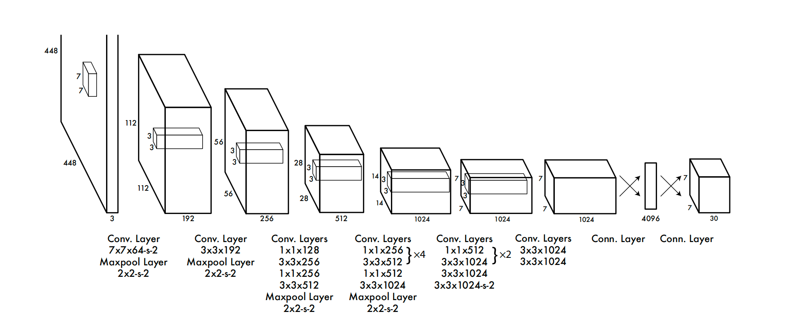
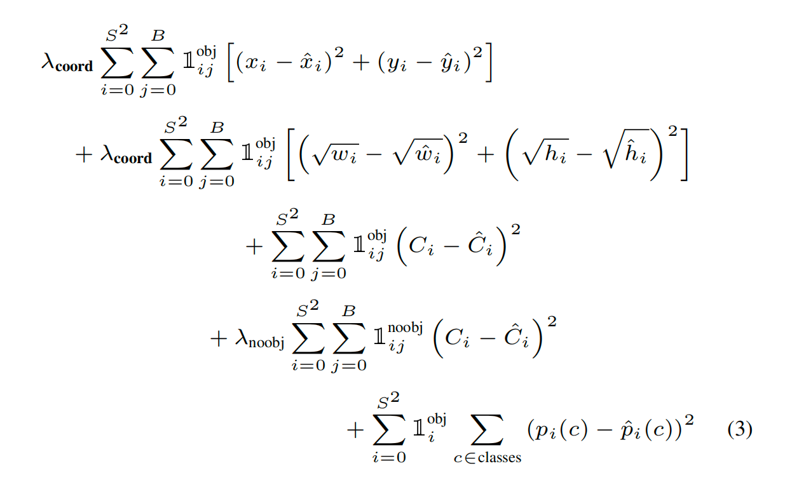

# YOLOv1
## 作者
Joseph Redmon  
You only look once  
Darknet 深度学习框架  
  

CVPR 2016  
TED redmon TED 2017  
TED 2018  
## 目标检测综述
图像分类，目标检测，实例分割（同一类别不同实例也区分），语义分割、全景分割（自动驾驶需要对所有像素分割）  
object detection in 20 years综述  
two-stage，one-stage检测  
DPM传统的目标检测  
R-CNN  
## 预测阶段
前向推断、推理  
YOLOv1架构  
图片分成sxs个网格，每个网格b个预测框  
输出:7x7x30，30 (x,y,w,h,c)*2 + 20个类别=30  
- 后处理：NMS  

设置阈值:0.2以下不处理，剩下按照置信度从大到小排序  
第一个保留，后续与第一个的IOU大于0.5，认为重复识别，丢弃后面即概率小的  
重复上述过程，直至不能再去除  
训练阶段不需要nms，每个框都会影响损失函数，训练和预测（推理）阶段是分开的  
## 训练阶段  
  
负责检测物体的bbox中心点定位误差  
+负责检测物体的bbox宽高定位误差  
+负责检测物体的bbox的confidence误差  
+不负责检测物体的bbox的confidence误差  
+负责检测物体grid cell分类误差  

## CVPR2016  
resnet、YOLOv1两个网络被提出  
DPM  
R-CNN  
Fast R-CNN  
Faster R-CNN，使用了RPN网络  
YOLO 45fps、63.4mAP  

